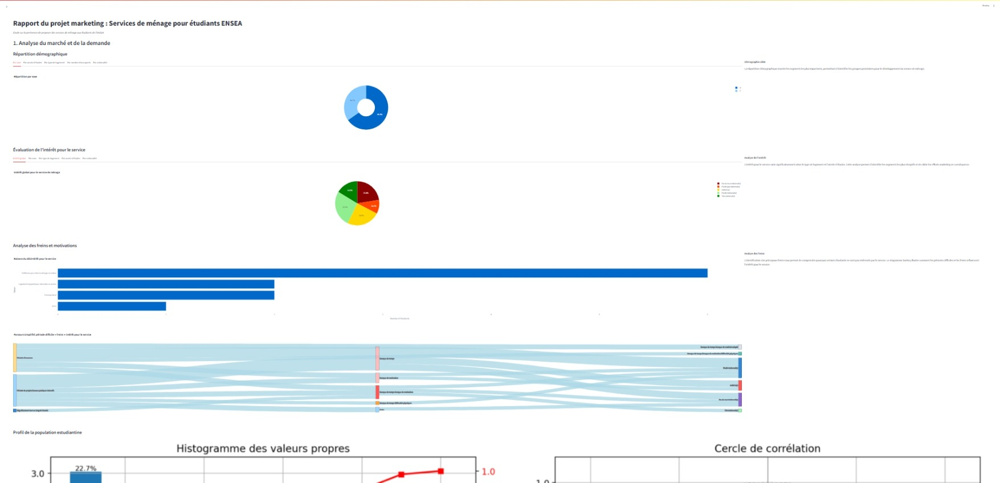

# Étude Marketing - Analyse des Ménages

Ce projet est une application interactive développée en Python, visant à explorer et visualiser les données issues d'une étude marketing sur l'implantation d'un service de ménage dans une cité estudiantine. L'application permet aux utilisateurs d'interagir avec une base de données de visualiser des tendances, d'avoir un rapport clair et dynamique.

## 📁 Structure du projet

```
Etude_Marketing-main/
│
├── app.py                   # Application principale (Streamlit)
├── requirements.txt         # Liste des dépendances Python
├── menage.jpg               # Image illustrative
├── pages/
│   ├── base_finale.xlsx     # Fichier de données (base d'analyse)
│   └── rapport.py           # Script complémentaire pour la visualisation
```

## 🚀 Lancement de l'application

### 1. Cloner ou télécharger le dépôt

```bash
git clone https://github.com/OlivierGBONOU/Etude_Marketing.git
```

### 2. Créer un environnement virtuel (optionnel mais recommandé)

```bash
python -m venv venv
source venv/bin/activate   # Linux/Mac
venv\Scripts\activate.bat  # Windows
```

### 3. Installer les dépendances

```bash
pip install -r requirements.txt
```

### 4. Lancer l'application Streamlit

```bash
streamlit run app.py
```

L'application s’ouvrira automatiquement dans votre navigateur.

## 📊 Fonctionnalités

- Chargement et affichage des données des ménages.
- Visualisation interactive (graphiques, filtres, tableaux).
- Analyse des tendances selon divers critères sociodémographiques.
- Rapport dynamique intégré (`rapport.py`).

## 🛠 Technologies utilisées

- Python
- Streamlit
- Pandas
- Matplotlib / Seaborn
- openpyxl / xlrd

## 📷 Capture d'écran



## 📜 Licence

Ce projet est libre d'utilisation à des fins éducatives. Pour une utilisation commerciale, merci de contacter l'auteur.